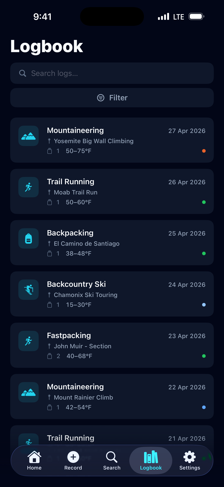
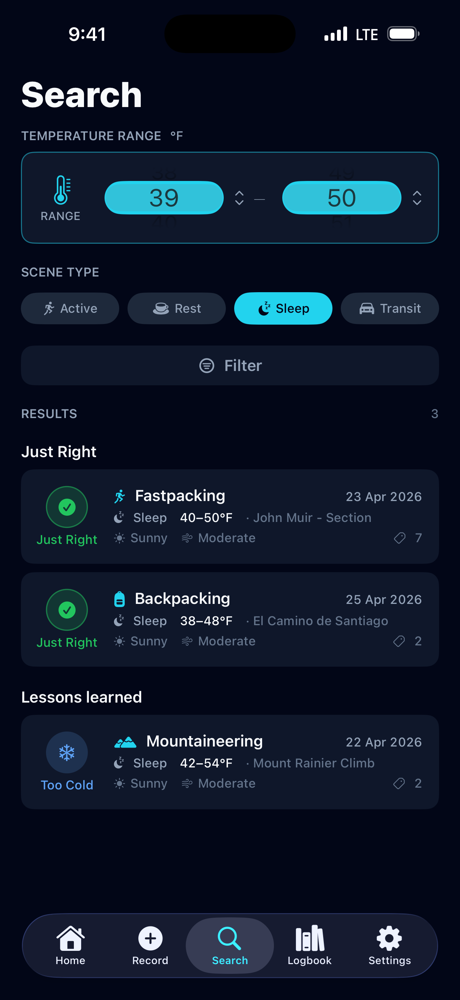
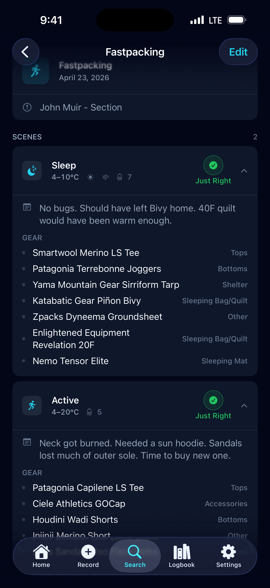
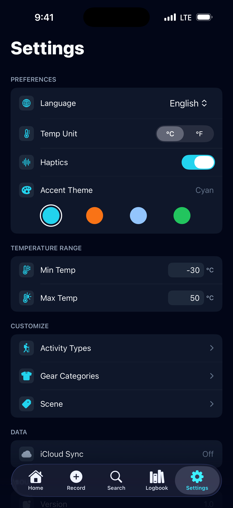
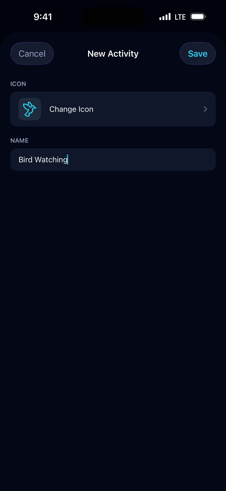
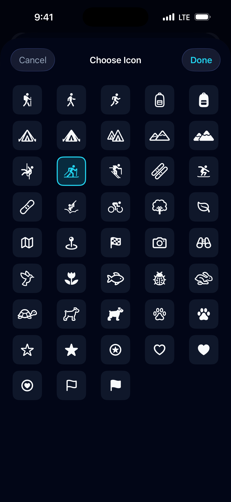

# Frequently Asked Questions (FAQ)

<p class="page-meta">Last updated: April 29, 2026</p>

- [About Thermal Buddy](#about-thermal-buddy)
  - [What is Thermal Buddy?](#what-is-thermal-buddy)
  - [Who made Thermal Buddy?](#who-made-thermal-buddy)
  - [Is Thermal Buddy available only on iOS?](#is-thermal-buddy-available-only-on-ios)
- [Screens & How to Use the App](#screens--how-to-use-the-app)
  - [What are the five main tabs?](#what-are-the-five-main-tabs)
  - [How does the Record flow work?](#how-does-the-record-flow-work)
  - [Can I edit or delete a saved log?](#can-i-edit-or-delete-a-saved-log)
  - [What is the Search tab for?](#what-is-the-search-tab-for)
  - [How are Search results ordered?](#how-are-search-results-ordered)
  - [What is the difference between Search and Logbook?](#what-is-the-difference-between-search-and-logbook)
- [Activities and Scenes](#activities-and-scenes)
  - [What is the difference between Activities and Scenes?](#what-is-the-difference-between-activities-and-scenes)
  - [Why does splitting into Scenes matter?](#why-does-splitting-into-scenes-matter)
- [Logging Gear](#logging-gear)
  - [How do I log gear in a Scene?](#how-do-i-log-gear-in-a-scene)
  - [What are Gear Categories?](#what-are-gear-categories)
- [Thermal Feedback](#thermal-feedback)
  - [What is the FELT rating?](#what-is-the-felt-rating)
  - [What is the "Just Right %" on the Home screen?](#what-is-the-just-right--on-the-home-screen)
- [Settings Customization](#settings-customization)
  - [What can I customize in Settings?](#what-can-i-customize-in-settings)
  - [What does "Temperature Range" in Settings do?](#what-does-temperature-range-in-settings-do)
- [Design Philosophy](#design-philosophy)
  - [Why is the app Dark Mode only?](#why-is-the-app-dark-mode-only)
  - [What is the philosophy behind the "Just Right" pulse?](#what-is-the-philosophy-behind-the-just-right-pulse)
- [Premium](#premium)
  - [Is Thermal Buddy free?](#is-thermal-buddy-free)
- [Data & Sync](#data--sync)
  - [Where is my data stored?](#where-is-my-data-stored)
  - [Does the app support iCloud sync?](#does-the-app-support-icloud-sync)
  - [How do I turn iCloud sync on or off?](#how-do-i-turn-icloud-sync-on-or-off)
  - [Can the developer see my personal logs?](#can-the-developer-see-my-personal-logs)
- [Privacy & AI](#privacy--ai)
  - [Does Thermal Buddy use generative AI for my data?](#does-thermal-buddy-use-generative-ai-for-my-data)
- [Troubleshooting & Support](#troubleshooting--support)
  - [iCloud sync is not working. What should I check?](#icloud-sync-is-not-working-what-should-i-check)
  - [I found a bug or want to request a feature.](#i-found-a-bug-or-want-to-request-a-feature-where-should-i-contact-you)

---

## About Thermal Buddy

### What is Thermal Buddy?

Thermal Buddy is an iOS app for hikers, backpackers, and trail runners who want to know what gear kept them comfortable — and what did not. After each outing you log the conditions, the gear you wore for each phase of the trip, and how you actually felt. Over time, the app builds a personal record you can search before your next adventure.

---

### Who made Thermal Buddy?

Thermal Buddy was designed and developed by Eiji, a hiker, backpacker, and trail runner. The idea came from his own experience — one too many nights shivering under a tarp, wishing he had a way to look back at what gear he had been wearing and what the conditions were like. That frustration turned into this app.

---

### Is Thermal Buddy available only on iOS?

Yes. Thermal Buddy is currently designed as a native iOS app.

---

## Screens & How to Use the App

### What are the five main tabs?

| Tab | What it does |
|-----|-------------|
| **Home** | Your dashboard. Shows total outings, your overall "Just Right" rate, and the five most recent logs. Tap any log to open its full details. |
| **Record** | Create a new log after an outing — a two-step flow covering the trip details and each Scene. |
| **Search** | Find which gear combinations worked for a given temperature range and scene type. |
| **Logbook** | Your complete history of all saved logs, with text search and multi-criteria filtering. |
| **Settings** | Customise Activities, Gear Categories, Scene labels, and app preferences. |

---

### How does the Record flow work?

Recording a log is a two-step process:

**Step 1 — Log Details**
Choose the Activity type (e.g. Hiking, Trail Running), set the date, and optionally add a location and notes. Tap **Next** when ready.

**Step 2 — Scenes**
Add one or more Scenes to capture the different phases of your outing. For each Scene you record:
- Scene type (Active, Rest, Sleep, or Transit)
- Temperature range (min / max)
- Weather and wind conditions (optional)
- The gear you were wearing, organised by category
- Your thermal feedback — how you actually felt

Once at least one Scene has been added, tap **Save**.

---

### Can I edit or delete a saved log?

Yes to both.

- **Edit**: Open any log from Home or Logbook, then tap **Edit** in the top-right corner. The same two-step flow opens in edit mode.
- **Delete**: In the Logbook, swipe left on any log card and tap the delete button.

---

### What is the Search tab for?

Search answers the question *"What gear worked for me in these conditions?"*

Set a temperature range using the wheel picker, choose a Scene type, and Thermal Buddy instantly retrieves matching scenes from your history, ranked into three groups:

- **Just Right** — scenes where you felt perfectly comfortable
- **Close matches** — scenes where you felt slightly cold or warm
- **Lessons learned** — scenes where you were too cold or too hot

The more logs you add, the more useful Search becomes.

---

### How are Search results ordered?

Within each group (Just Right / Close matches / Lessons learned), results are ranked by a safety-aware scoring formula designed around one principle: **being colder than expected is riskier than being warmer**.

**Plain-language version**

1. **Coverage** — Records that cover your searched temperature range rank higher. For example, if you search 0–10 °C and a record only reaches down to 2 °C, it is missing 2 °C of cold-side coverage and ranks lower than a record that goes to 0 °C or below.
2. **Cold side weighted double** — A 1 °C gap on the cold side counts twice as heavily as a 1 °C gap on the warm side, because unexpected cold carries greater real-world risk.
3. **Precision** — When coverage is equal, a record whose temperature range is closer to your search range ranks higher. A 0–10 °C record ranks above a −5–15 °C record for the same search, because the tighter match is a more meaningful reference.
4. **Recency** — When scores are equal, the more recent record ranks higher.

**For the technically curious — the scoring formula**

```
minRisk      = max(0, record.min − search.min)   // cold-side gap not covered [°C]
maxRisk      = max(0, search.max − record.max)   // warm-side gap not covered [°C]
precisionGap = max(0, search.min − record.min)
             + max(0, record.max − search.max)   // how far record extends beyond search [°C]

score = minRisk × 2 + maxRisk × 1 + precisionGap
```

Lower score = higher ranking. Ties are resolved in this order: weighted risk → cold-end distance → record date (newest first).

> If demand warrants it, a future Advanced Settings option may let you adjust the cold-side weighting multiplier (currently ×2) to match your personal risk tolerance.

---

### What is the difference between Search and Logbook?

**Logbook** is a chronological archive. Use it to browse or search your history by keyword, activity, or date — for reviewing what happened on a past trip.

<div style="display: flex; gap: 10px; flex-wrap: wrap;">
  
</div>

**Search** is a gear-recommendation engine. You describe future conditions (temperature + scene type) and it surfaces past scenes where your gear performed well — for planning what to wear next time.

<div style="display: flex; gap: 10px; flex-wrap: wrap;">
  
  
</div>

---

## Activities and Scenes

### What is the difference between Activities and Scenes?

An **Activity** describes the type of outing you are logging — for example, Hiking, Trail Running, or Backpacking. You assign one Activity per log entry.

A **Scene** represents a distinct phase *within* that outing. Each log can contain up to four Scenes:

| Scene | When you use it |
|-------|-----------------|
| **Active** | While you are moving — hiking, running, climbing |
| **Rest** | A short break during the outing |
| **Sleep** | Overnight or a nap inside a shelter or sleeping bag |
| **Transit** | Traveling to or from the trailhead — car, bus, train |

For each Scene you record the temperature range, weather, wind, the gear you were wearing, and how you felt thermally.

---

### Why does splitting into Scenes matter?

Your thermal comfort changes dramatically between moving and stopping, especially in cold conditions. By logging Active and Rest (or Sleep) separately, you build a precise picture of how your gear performs across different intensity levels — not just on average. This is also what makes Search results meaningful: it matches conditions at the scene level, not the trip level.

---

## Logging Gear

### How do I log gear in a Scene?

Inside the Scene editor, tap **Add Gear Item**. For each item you can enter:
- **Brand** (e.g. Patagonia)
- **Name** (e.g. Nano Puff)
- **Gear Category** (e.g. Outer)

You can add as many items as you like per Scene, and edit or remove them at any time.

---

### What are Gear Categories?

Gear Categories are labels used to organise your items within a Scene. The default categories are:

Tops · Bottoms · Outer · Shoes · Backpacks · Accessories · Sleeping Bag/Quilt · Sleeping Mat · Shelter · Other

You can rename, reorder, or hide categories in **Settings → Gear Categories**, and add your own custom ones.

---

## Thermal Feedback

### What is the FELT rating?

After recording the conditions for a Scene, you rate how you actually felt during that phase. There are five options:

| Rating | Meaning |
|--------|---------|
| **Too Cold** | You were uncomfortably cold |
| **Cold** | Slightly cooler than ideal |
| **Just Right** | Perfectly comfortable |
| **Hot** | Slightly warmer than ideal |
| **Too Hot** | Uncomfortably warm |

The FELT rating is the core signal Thermal Buddy uses to rank Search results. A scene rated "Just Right" is ranked highest; "Too Cold" and "Too Hot" appear under "Lessons learned."

---

### What is the "Just Right %" on the Home screen?

It is the percentage of all your recorded Scenes that you rated "Just Right." It is a quick summary of how well your gear choices have been working overall. The higher the number, the more consistently you have been getting your layering right.

---

## Settings Customization

### What can I customize in Settings?

In the Settings area you can customize:

- **Activity Types** — rename, reorder, hide, or add your own (including icons)
- **Gear Categories** — rename, reorder, hide, or add your own
- **Scene Customization** — change the label and icon for each of the four Scene types
- **App Language** — English or Japanese
- **Temperature Unit** — Celsius or Fahrenheit
- **Temperature Range** — the min/max range available on the temperature wheel picker
- **Accent Theme** — the highlight colour used throughout the app

<div style="display: flex; gap: 10px; flex-wrap: wrap;">
  
  
  
</div>

---

### What does "Temperature Range" in Settings do?

It sets the lower and upper bounds of the temperature wheel picker used when recording a Scene and when searching. The default range is −30 to 50 °C (−22 to 122 °F), which covers most outdoor conditions. If you regularly operate in more extreme environments — or want a tighter range for easier picking — you can adjust these bounds here.

---

## Design Philosophy

### Why is the app Dark Mode only?

Outdoor gear management often happens in the "shoulder hours"—early morning alpine starts, inside a dim tent at night, or at a dark trailhead. 

- **Preserving Night Vision**: A bright white screen can be blinding in the dark. Dark mode keeps your eyes adjusted to the environment.
- **Battery Efficiency**: On OLED screens, dark mode significantly reduces power consumption, which is critical when you are away from a charger for multiple days.
- **Precision Aesthetic**: We believe gear management is a serious task. The "Slate and Cyan" aesthetic is designed to feel like a precision instrument.

---

### What is the philosophy behind the "Just Right" pulse?

When you achieve a "Just Right" thermal rating, the icon on the Home screen and in your stats performs a subtle, ambient "breathing" pulse.

This is the app’s "signature moment." It’s a quiet celebration of successful preparation. We chose a slow, rhythmic pulse rather than a flashy animation to reflect the calm and confidence that comes with having the right gear for the conditions.

---

## Premium

### Is Thermal Buddy free?

Thermal Buddy is free to download and includes up to **8 logs** at no cost. Once you reach that limit, a Premium upgrade is required to keep adding logs. Premium is available as a yearly subscription or a one-time lifetime purchase.

All existing logs remain fully accessible regardless of your subscription status.

---

## Data & Sync

### Where is my data stored?

Your app data is stored locally on your device.

---

### Does the app support iCloud sync?

Yes. If iCloud is enabled on your device, your data syncs through your private iCloud account so it is available across your Apple devices.

---

### How do I turn iCloud sync on or off?

iCloud sync is controlled from your iPhone's Settings app, not from within Thermal Buddy.

**To turn it on or off:**

1. Open the iPhone **Settings** app
2. Tap your name at the top (Apple Account)
3. Tap **iCloud**
4. Tap **Apps Using iCloud** (you may need to tap **Show All**)
5. Find **Thermal Buddy** and toggle it on or off

When sync is off, your logs remain on the current device only and will not appear on other Apple devices signed into the same iCloud account.

---

### Can the developer see my personal logs?

No. Your user-generated data is not accessible to us.

---

## Privacy & AI

### Does Thermal Buddy use generative AI for my data?

No. Thermal Buddy does not use generative AI to process your personal data. All search and ranking is performed on-device using your own logged history.

---

## Troubleshooting & Support

### iCloud sync is not working. What should I check?

Please verify:
- You are signed in to iCloud on your device
- Thermal Buddy is enabled in **Settings → [Your Name] → iCloud → Apps Using iCloud** (see [How do I turn iCloud sync on or off?](#how-do-i-turn-icloud-sync-on-or-off))
- iCloud Drive is enabled
- A network connection is available

If sync still does not work, please report the issue on GitHub.

---

### I found a bug or want to request a feature. Where should I contact you?

Please open an issue on our [GitHub Issues page](https://github.com/nicola-vibecoder/thermal-buddy/issues).

---

