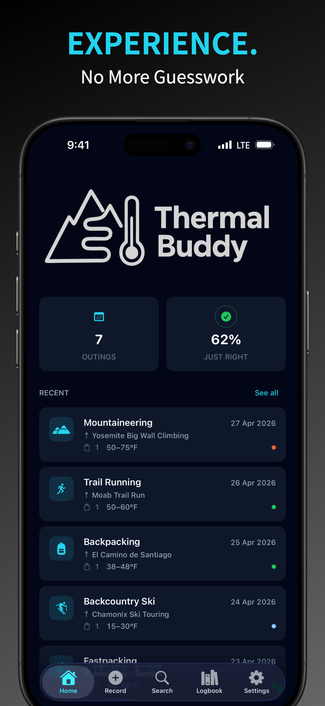
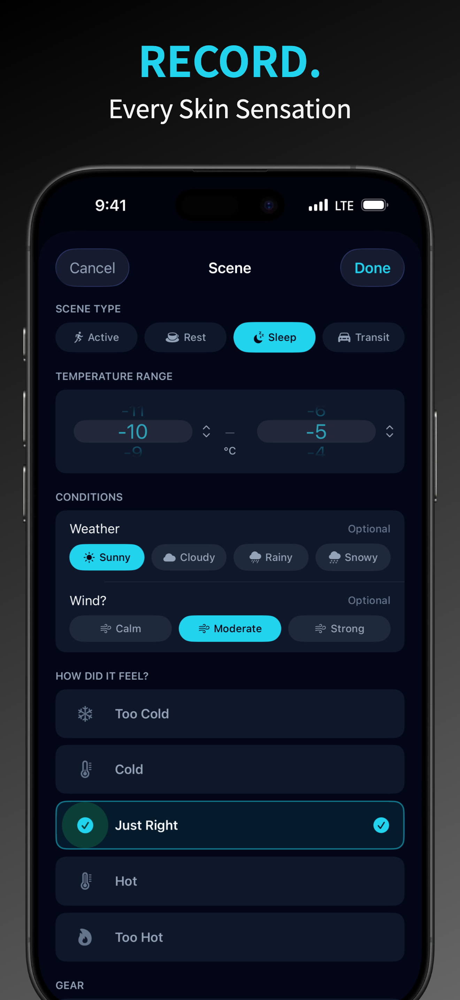
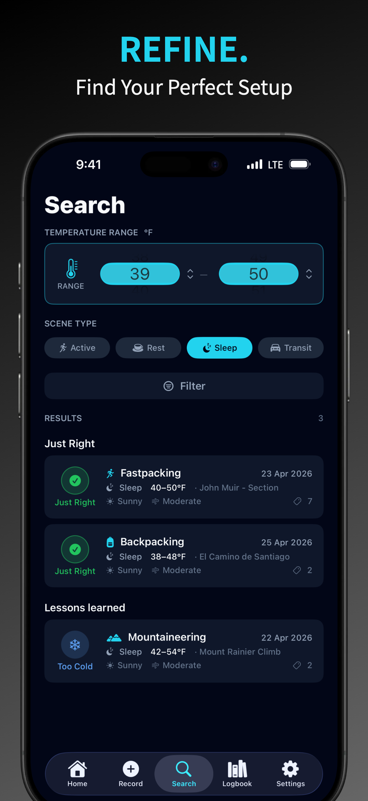

# Welcome to Thermal Buddy

### How Thermal Buddy works

- **Record**: After your run or hike, log the temperature, wear + gear, and your actual skin sensation.
- **Build**: Create your personal database of what worked and what didn't in real conditions.
- **Plan**: No more guessing. Use your history to dial in the perfect layering for your next adventure.

### Why Thermal Buddy?

- **Built for Hikers, by a hiker** - from real trail experience to solve real layering mistakes.
- **Practical & Personal**: Move beyond generic charts; rely on your own unique comfort levels.

  <a href="https://apps.apple.com/app/apple-store/id6764351164?pt=128836898&ct=Support%20Page%20Link&mt=8" class="app-store-button" onclick="zaraz.track('APPSTORE_CLICK');">Try it Free on the App Store</a>

  

    

      
      
      
    

  

  

    <button class="carousel-dot active" aria-label="Slide 1" onclick="tbCarousel.go(0)"></button>
    <button class="carousel-dot" aria-label="Slide 2" onclick="tbCarousel.go(1)"></button>
    <button class="carousel-dot" aria-label="Slide 3" onclick="tbCarousel.go(2)"></button>
  

  

    <a href="https://apps.apple.com/app/apple-store/id6764351164?pt=128836898&ct=Support%20Page%20Link&mt=8" class="app-store-button" onclick="zaraz.track('APPSTORE_CLICK');">Try it Free on the App Store</a>
  

  

    <strong>Menu</strong>
    
  

---

