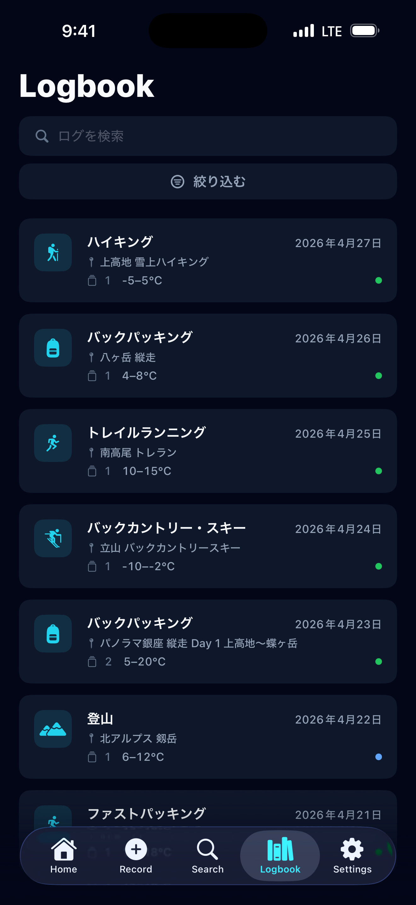
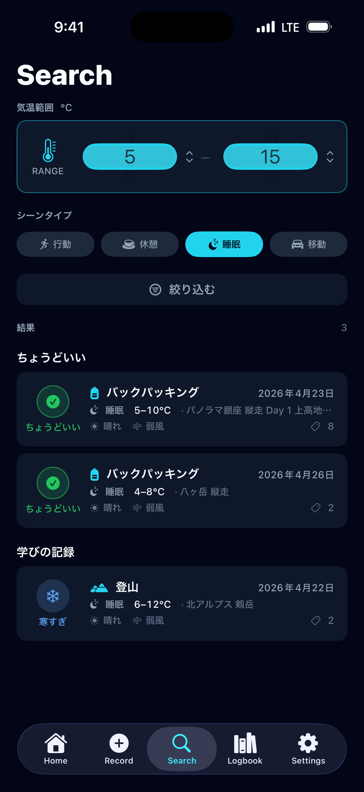
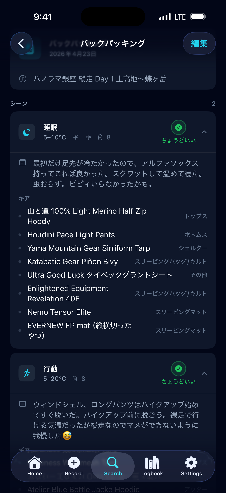
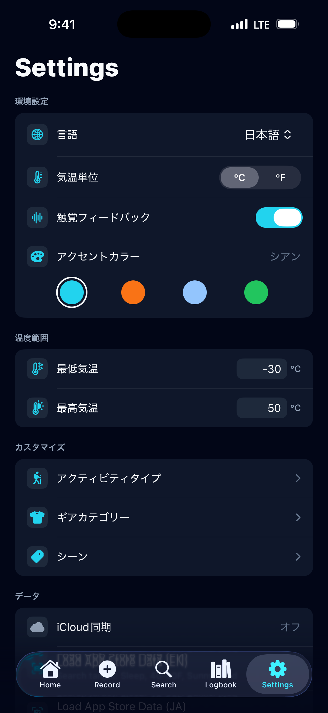
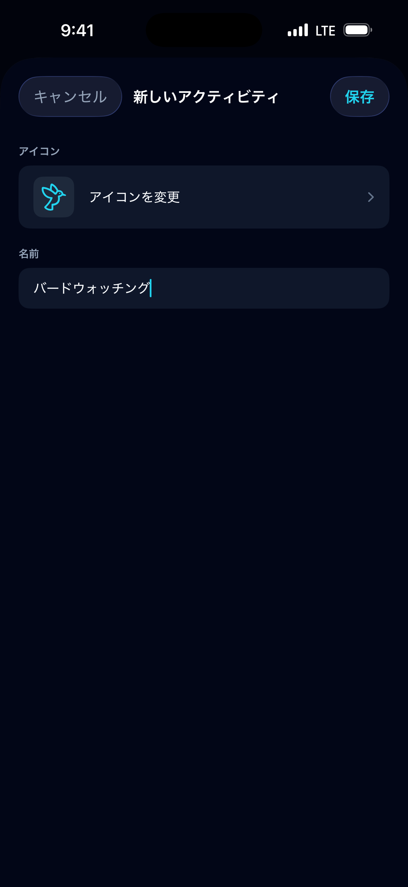
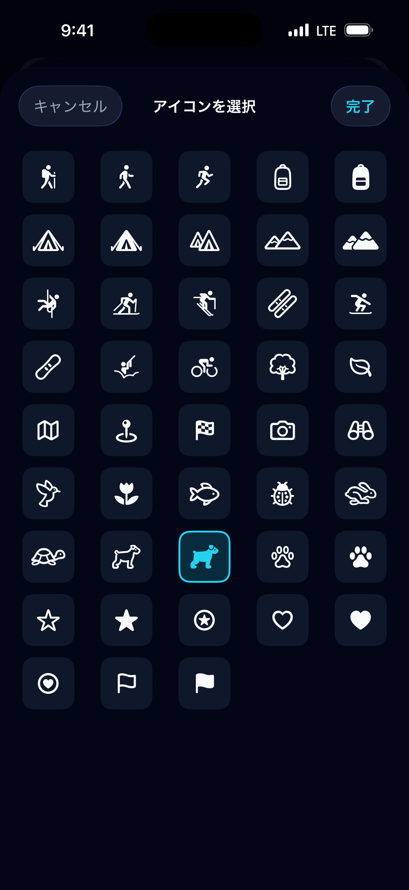



# よくある質問 (FAQ)

<p class="page-meta">最終更新: 2026年4月29日</p>

- [Thermal Buddy について](#thermal-buddy-について)
  - [Thermal Buddy でできることは？](#thermal-buddy-でできることは)
  - [誰が作ったの？](#誰が作ったの)
  - [iOS 専用ですか？](#ios-専用ですか)
- [画面の見方・使い方](#画面の見方使い方)
  - [5つのタブの役割は？](#5つのタブの役割は)
  - [Record（記録）の流れは？](#record記録の流れは)
  - [保存済みのログを編集・削除できますか？](#保存済みのログを編集削除できますか)
  - [Search タブは何のためにあるの？](#search-タブは何のためにあるの)
  - [Search の結果はどのような順番で表示されますか？](#search-の結果はどのような順番で表示されますか)
  - [Search と Logbook の違いは？](#search-と-logbook-の違いは)
- [アクティビティとシーン](#アクティビティとシーン)
  - [アクティビティとシーンの違いは？](#アクティビティとシーンの違いは)
  - [シーンを分けて記録する意味は？](#シーンを分けて記録する意味は)
- [ギアの記録](#ギアの記録)
  - [シーンにギアを登録するには？](#シーンにギアを登録するには)
  - [ギアカテゴリーとは？](#ギアカテゴリーとは)
- [体感フィードバック](#体感フィードバック)
  - [体感評価（FELT）とは？](#体感評価feltとは)
  - [Home 画面の「ちょうどいい率」とは？](#home-画面のちょうどいい率とは)
- [Settings のカスタマイズ](#settings-のカスタマイズ)
  - [Settings で何をカスタマイズできますか？](#settings-で何をカスタマイズできますか)
  - [「気温範囲」の設定は何をするの？](#気温範囲の設定は何をするの)
- [デザイン・フィロソフィー](#デザインフィロソフィー)
  - [なぜダークモード専用なのですか？](#なぜダークモード専用なのですか)
  - [「ちょうどいい」のパルス（鼓動）アニメーションの意味は？](#ちょうどいいのパルス鼓動アニメーションの意味は)
- [プレミアム](#プレミアム)
  - [Thermal Buddy は無料で使えますか？](#thermal-buddy-は無料で使えますか)
- [データと同期](#データと同期)
  - [データはどこに保存されますか？](#データはどこに保存されますか)
  - [iCloud 同期に対応していますか？](#icloud-同期に対応していますか)
  - [開発者がログを見ることはありますか？](#開発者がログを見ることはありますか)
- [プライバシーと AI](#プライバシーと-ai)
  - [生成 AI はデータに使われていますか？](#生成-ai-はデータに使われていますか)
- [トラブルシューティングとサポート](#トラブルシューティングとサポート)
  - [iCloud 同期がうまくいかない場合は？](#icloud-同期がうまくいかない場合は)
  - [バグ報告や機能リクエストはどこから？](#バグ報告や機能リクエストはどこから)

---

## Thermal Buddy について

### Thermal Buddy でできることは？

Thermal Buddy は、ハイカー・バックパッカー・トレイルランナーのための iOS アプリです。山行のたびに、コンディション・着用したギア・体感を記録していくことで、「あの日なぜ寒かったのか／快適だったのか」がいつでも振り返れるようになります。記録が増えるほど、次の山行のレイヤリング選びに役立つパーソナルデータベースになります。

---

### 誰が作ったの？

Thermal Buddy は、ハイカー・バックパッカー・トレイルランナーでもある Eiji が設計・開発しました。タープの下で震えながら「あのとき何を着ていたか、気温は何度だったか」をどうしても思い出せなかった経験が、このアプリを作るきっかけになりました。

---

### iOS 専用ですか？

はい。Thermal Buddy は現在、iOS ネイティブアプリとして開発されています。

---

## 画面の見方・使い方

### 5つのタブの役割は？

| タブ | 役割 |
|------|------|
| **Home** | ダッシュボード。総アクティビティ数・「ちょうどいい率」・最近の5件を表示。ログをタップすると詳細を確認できます。 |
| **Record** | 山行後にログを新規作成する画面。2ステップで記録します。 |
| **Search** | 指定した気温範囲とシーンタイプに合うギアの組み合わせを過去の記録から検索します。 |
| **Logbook** | すべてのログの一覧。テキスト検索・絞り込みに対応しています。 |
| **Settings** | アクティビティタイプ・ギアカテゴリー・シーン表示・環境設定などのカスタマイズ。 |

---

### Record（記録）の流れは？

記録は2ステップで完了します。

**ステップ 1 — ログの基本情報**
アクティビティ（例：ハイキング、トレイルランニング）を選び、日付を設定します。場所やメモは任意で入力できます。入力後、**次へ** をタップ。

**ステップ 2 — シーン**
山行の各局面を1つ以上のシーンとして追加します。各シーンには以下を記録します：
- シーンタイプ（行動 / 休憩 / 睡眠 / 移動）
- 気温範囲（最低・最高）
- 天気・風（任意）
- 着用したギア（カテゴリー別）
- 体感（実際にどう感じたか）

シーンが1つ以上追加されたら、**保存** をタップして完了です。

---

### 保存済みのログを編集・削除できますか？

どちらも可能です。

- **編集**：Home または Logbook からログを開き、右上の **編集** をタップ。同じ2ステップフローが編集モードで開きます。
- **削除**：Logbook でログカードを左にスワイプし、削除ボタンをタップします。

---

### Search タブは何のためにあるの？

Search は「このコンディションで、自分に合うギアは何か？」という問いに答えるための機能です。

気温範囲をホイールピッカーで設定し、シーンタイプを選ぶと、過去の記録から該当するシーンを3グループに分けて表示します：

- **ちょうどいい** — 快適と感じたシーン
- **近いコンディション** — やや寒い／やや暑いと感じたシーン
- **学びの記録** — 寒すぎ／暑すぎだったシーン

記録が増えるほど、Search の結果は精度を増します。

---

### Search の結果はどのような順番で表示されますか？

各グループ（ちょうどいい / 近いコンディション / 学びの記録）の中での並び順は、**「想定より寒かった」は「想定より暑かった」よりリスクが高い**という考え方に基づいたスコアで決まります。

**わかりやすい説明**

1. **カバー率** — 検索した気温域を実際に経験しているログが上位になります。たとえば 0〜10 °C で検索したとき、2〜10 °C のログは寒い側を 2 °C 経験していないため、0 °C 以下まで記録されているログより下に表示されます。
2. **寒い側は 2 倍の影響** — 寒い側の未カバーは、暖かい側の同じ幅の未カバーより 2 倍スコアに影響します。予想外の寒さには大きなリスクが伴うためです。
3. **精度** — カバー率が同じなら、検索した気温範囲に近いログが上位です。0〜10 °C で検索した場合、0〜10 °C のログは −5〜15 °C のログより上位になります。幅の広すぎる記録は参考精度が下がるためです。
4. **新しい記録優先** — スコアが同じ場合は、より最近の記録が上位に表示されます。

**数式で確認したい方へ**

```
minRisk      = max(0, ログの最低気温 − 検索の最低気温)   // 寒い側の未カバー量 [°C]
maxRisk      = max(0, 検索の最高気温 − ログの最高気温)   // 暖かい側の未カバー量 [°C]
precisionGap = max(0, 検索の最低気温 − ログの最低気温)
             + max(0, ログの最高気温 − 検索の最高気温)   // 検索範囲を超えた広がり [°C]

スコア = minRisk × 2 + maxRisk × 1 + precisionGap
```

スコアが低いほど上位。同点の場合は、加重リスク → 最低気温の近さ → 記録日（新しい順）の優先順で決定します。

> ご要望が多ければ、寒い側の係数（現在 ×2）をカスタマイズできる Advanced Settings の追加も検討します。

---

### Search と Logbook の違いは？

**Logbook** は時系列のアーカイブです。キーワード・アクティビティ・日付で過去の山行を振り返るために使います。

<div style="display: flex; gap: 10px; flex-wrap: wrap;">
  
</div>

**Search** はギアの提案エンジンです。これから挑む山行のコンディション（気温＋シーンタイプ）を指定すると、うまくいった過去のシーンを優先して表示します。「次に何を着るか」を決めるために使います。

<div style="display: flex; gap: 10px; flex-wrap: wrap;">
  
  
</div>

---

## アクティビティとシーン

### アクティビティとシーンの違いは？

**アクティビティ**は、その山行の種類を表します（例：ハイキング、トレイルランニング、バックパッキング）。1件のログに対して1つ設定します。

**シーン**は、その山行の中の「局面」を表します。1件のログに対して最大4種類のシーンを記録できます：

| シーン | 使うタイミング |
|--------|----------------|
| **行動** | 歩いている・走っている・登っているとき |
| **休憩** | 山行中の小休止 |
| **睡眠** | テント・シェルター内での就寝・仮眠 |
| **移動** | 登山口までの車・電車・バスでの移動 |

各シーンには、気温範囲・天気・風・着用ギア・体感を記録します。

---

### シーンを分けて記録する意味は？

行動中と停止中では、体感温度がまったく異なります。特に寒い日は顕著です。「行動」と「休憩」（または「睡眠」）を別シーンとして記録することで、強度別にギアのパフォーマンスを把握できます。Search の結果も山行全体ではなくシーン単位でマッチングするため、より正確な提案が得られます。

---

## ギアの記録

### シーンにギアを登録するには？

シーン編集画面で **ギアを追加** をタップします。各アイテムに以下を入力できます：
- **ブランド**（例：Patagonia）
- **アイテム名**（例：Nano Puff）
- **ギアカテゴリー**（例：アウター）

1つのシーンに何点でも登録でき、後から編集・削除も可能です。

---

### ギアカテゴリーとは？

シーン内のアイテムを分類するためのラベルです。デフォルトのカテゴリーは以下のとおりです：

トップス・ボトムス・アウター・シューズ・バックパック・アクセサリー・スリーピングバッグ/キルト・スリーピングマット・シェルター・その他

**Settings → ギアカテゴリー** から、名前の変更・並び替え・非表示・カスタムカテゴリーの追加ができます。

---

## 体感フィードバック

### 体感評価（FELT）とは？

シーンを記録する際に、そのときの体感を5段階で評価します：

| 評価 | 意味 |
|------|------|
| **寒すぎ** | 不快なほど寒かった |
| **寒い** | 理想より少し寒かった |
| **ちょうどいい** | 快適だった |
| **暑い** | 理想より少し暑かった |
| **暑すぎ** | 不快なほど暑かった |

この体感評価が、Search の結果ランキングの核になります。「ちょうどいい」と評価したシーンが最上位に表示され、「寒すぎ」「暑すぎ」は「学びの記録」として表示されます。

---

### Home 画面の「ちょうどいい率」とは？

これまでに記録したすべてのシーンのうち、「ちょうどいい」と評価した割合です。自分のレイヤリングがどれだけうまくいっているかを一目で確認できる指標です。数値が高いほど、快適なギア選びが安定しているということです。

---

## Settings のカスタマイズ

### Settings で何をカスタマイズできますか？

Settings では以下をカスタマイズできます：

- **アクティビティタイプ** — 名前・アイコンの変更、並び替え、非表示、カスタム追加
- **ギアカテゴリー** — 名前の変更、並び替え、非表示、カスタム追加
- **シーンのカスタマイズ** — 行動 / 休憩 / 睡眠 / 移動それぞれのラベルとアイコンを変更
- **言語** — English または 日本語
- **気温単位** — 摂氏 (°C) または 華氏 (°F)
- **気温範囲** — 気温ホイールピッカーの最小・最大値
- **アクセントカラー** — アプリ全体のハイライトカラー

<div style="display: flex; gap: 10px; flex-wrap: wrap;">
  
  
  
</div>

---

### 「気温範囲」の設定は何をするの？

シーンの記録時および Search で使用する、気温ホイールピッカーの上限・下限を設定します。デフォルトは −30〜50 °C（−22〜122 °F）で、一般的な登山・アウトドア活動をカバーしています。より極端な環境で活動する場合や、ピッカーをより使いやすい範囲に絞りたい場合に調整してください。

---

## デザイン・フィロソフィー

### なぜダークモード専用なのですか？

山の装備管理は、早朝の出発前、夜のテント内、あるいは暗い登山口など、光の少ない環境で行われることが多いからです。

- **夜間視力の保護**: 暗闇の中で真っ白な画面を見ると、目が眩んでしまいます。ダークモードは周囲の環境に目を慣らしたまま操作できるよう配慮しています。
- **バッテリーの節約**: OLED（有機EL）ディスプレイでは、黒い画面は消費電力を大幅に抑えられます。数日間にわたる縦走など、充電が難しい環境ではこの差が重要になります。
- **精密機器のような美学**: 装備管理は一種の「精密な作業」であると考えています。スレート（石板）とシアンを基調としたデザインは、プロフェッショナルな道具としての信頼感を表現しています。

---

### 「ちょうどいい」のパルス（鼓動）アニメーションの意味は？

体感評価で「ちょうどいい」を達成すると、Home 画面のアイコンが静かに、ゆっくりと「呼吸」するように点滅します。

これは、Thermal Buddy における「最高の瞬間」を祝うための演出です。派手なエフェクトではなく、あえてリズム感のある穏やかなパルスを採用したのには理由があります。それは、適切な装備を選び抜いたときに得られる「静かな自信」と「安心感」を表現したかったからです。

---

## プレミアム

### Thermal Buddy は無料で使えますか？

ダウンロードは無料で、**8件まで**のログを無料で記録できます。上限に達すると、新しいログの追加にはプレミアムへのアップグレードが必要です。プレミアムは年額プランとライフタイム（買い切り）の2種類から選べます。

プレミアムの有無にかかわらず、保存済みのログはいつでも閲覧できます。

---

## データと同期

### データはどこに保存されますか？

すべてのデータはデバイス内にローカル保存されます。

---

### iCloud 同期に対応していますか？

はい。デバイスで iCloud が有効になっていれば、プライベートな iCloud アカウントを通じて複数の Apple デバイス間でデータを同期できます。

---

### 開発者がログを見ることはありますか？

ありません。ユーザーが作成したデータに開発者はアクセスできません。

---

## プライバシーと AI

### 生成 AI はデータに使われていますか？

使用していません。Thermal Buddy は生成 AI を使ってユーザーのデータを処理しません。Search の結果ランキングはすべてデバイス上で、ユーザー自身の記録をもとに行われます。

---

## トラブルシューティングとサポート

### iCloud 同期がうまくいかない場合は？

以下をご確認ください：
- デバイスで iCloud にサインインしている
- iCloud Drive が有効になっている
- iOS 設定 → Apple アカウント → iCloud で Thermal Buddy の使用が許可されている
- ネットワークに接続されている

それでも解決しない場合は、GitHub で報告してください。

---

### バグ報告や機能リクエストはどこから？

[GitHub の Issues ページ](https://github.com/nicola-vibecoder/thermal-buddy/issues)で Issue を作成してご報告ください。

---
{{ site.copyright }}
