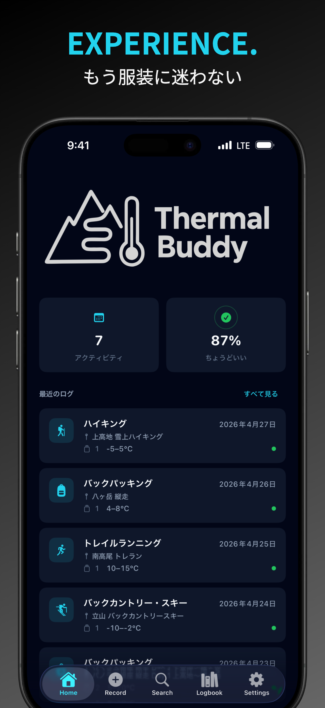
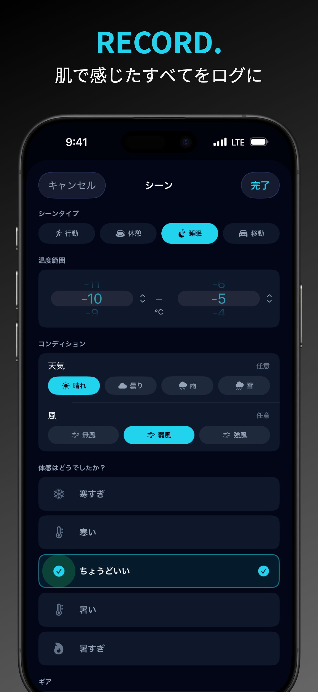
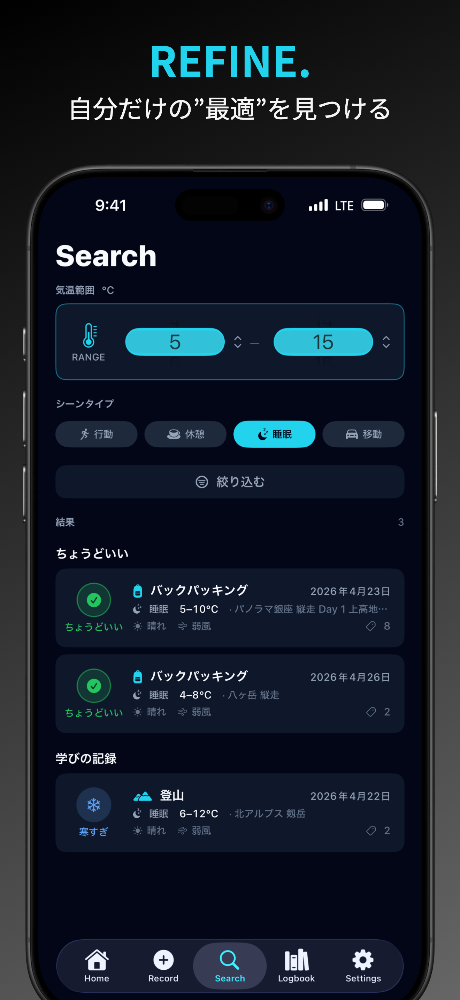

# Thermal Buddy へようこそ

### Thermal Buddy の使い方

- **RECORD**: ハイキングやランの後に、気温、天候、着用ウェア・ギア、そして「暑かった」「寒かった」「ちょうどよかった」という体感を記録します。
- **REFINE**: 実際のフィールドで「何がうまくいき、何がダメだったか」を自分だけのデータベースとして蓄積します。
- **ENJOY**: もう勘に頼らない。データを使って、次の山行に最適なレイヤリングやスリーピングギアを導き出しましょう。あとは、ただアウトドア体験を楽しむだけです。

### なぜ Thermal Buddy？

- **ハイカーが、ハイカーのために作った**: バックパッカーでありトレイルランナーでもある開発者のEijiが、タープの下で何度も寒さに震え、眠れない夜を過ごした経験からこのアプリを作りました。「勘」に頼ったウェアやスリーピングギア選びの失敗 - あの「寒い」失敗 - を何度も繰り返さないために。
- **あなたの「ちょうどいい」は、あなただけのもの**: あなた自身の「快適」を基準にしましょう。快適な体感温度に「万人向け」の正解はありません。
- **高いカスタマイズ性**: どんなアウトドアアクティビティでも、Thermal Buddyは対応します。アクティビティ、シーン、ギアカテゴリーを自由にカスタマイズして、あなたが必要とするデータだけを記録できます。アイコンもあなた好みに変更できます。

  <a href="https://apps.apple.com/app/apple-store/id6764351164?pt=128836898&ct=Support%20Page%20Link&mt=8" class="app-store-button" onclick="zaraz.track('APPSTORE_CLICK');">App Store で無料で試す</a>

  

    

      
      
      
    

  

  

    <button class="carousel-dot active" aria-label="スライド 1" onclick="tbCarousel.go(0)"></button>
    <button class="carousel-dot" aria-label="スライド 2" onclick="tbCarousel.go(1)"></button>
    <button class="carousel-dot" aria-label="スライド 3" onclick="tbCarousel.go(2)"></button>
  

  

    <a href="https://apps.apple.com/app/apple-store/id6764351164?pt=128836898&ct=Support%20Page%20Link&mt=8" class="app-store-button" onclick="zaraz.track('APPSTORE_CLICK');">App Store で無料で試す</a>
  

  

    <strong>メニュー</strong>
    
  

---

